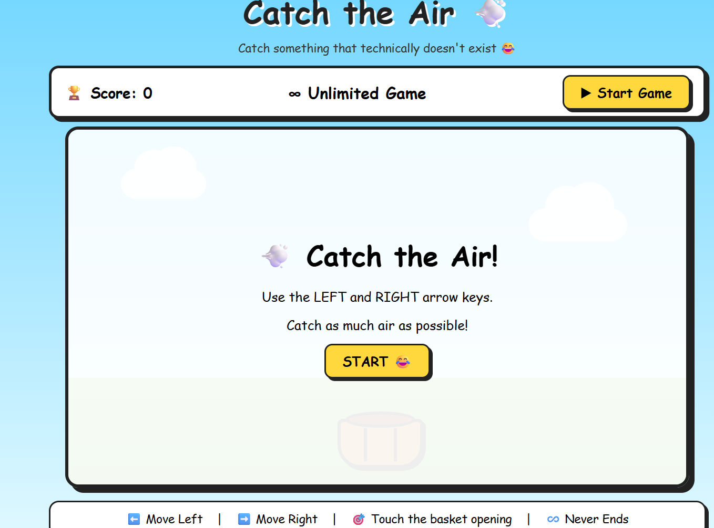
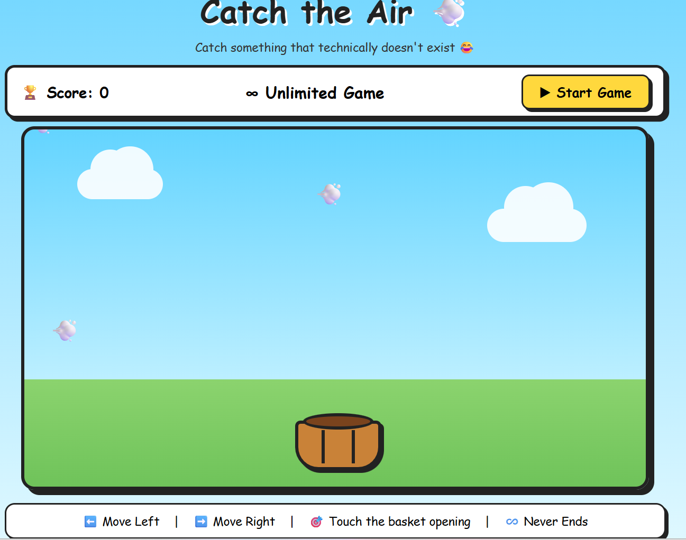
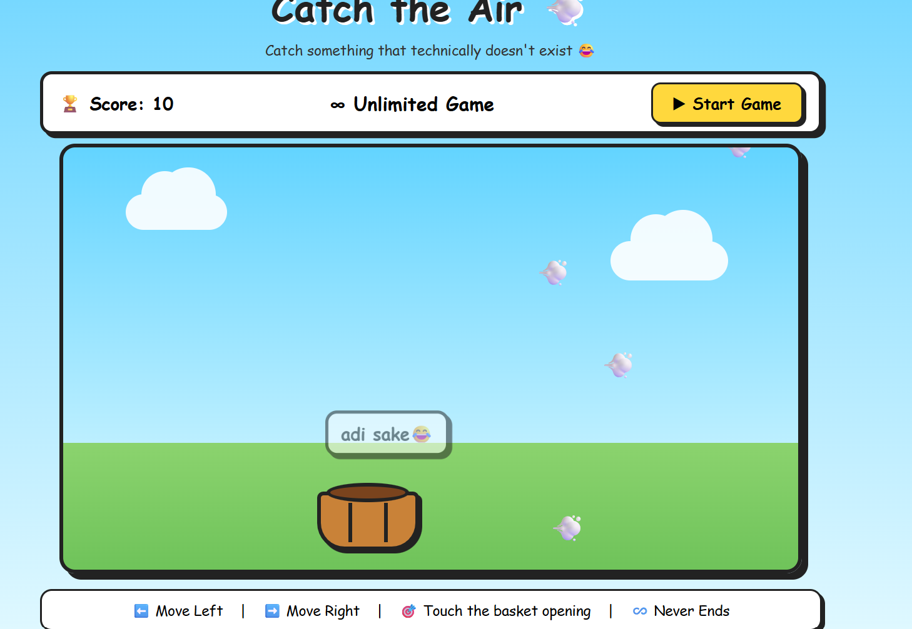

# [catching] 🎯

## Basic Details
### Team Name: code x

### Team Members
- Member 2: [Nisam] - [ICCSCEM]
- Member 3: [Devasurya] - [ICCSCEM]

### Project Description
[Catch the Air 💨 is a simple and humorous browser-based game developed using HTML, CSS, and JavaScript. The main objective of the game is to move a basket using the left and right arrow keys and catch the falling air (💨).

The game is intentionally designed as a useless/funny project, since catching air has no practical purpose. The game has an unlimited scoring system, so the player can continue playing without a time limit. Whenever the air touches the basket opening, the score increases and a random funny message is displayed.

The project demonstrates basic concepts of web development, animation, keyboard controls, collision detection, DOM manipulation, timers, and interactive user interfaces while maintaining a comic and entertaining design.]

###In everyday life, air is everywhere, but nobody tries to catch it. This project humorously creates a completely unnecessary problem: “What if we need to catch air?” 💨😂

The player must move a basket and catch falling air. If the air touches the basket, the player earns a point. There is no real-world purpose or actual problem to solve—the entire challenge is intentionally useless, funny, and entertaining.

### The Solution (that nobody asked for)
[We solved this completely unnecessary problem by creating Catch the Air 💨 — a game that gives the player a basket and a very important mission: catch absolutely nothing useful! 😂

The player moves the basket left and right using the arrow keys while invisible “air” falls from the sky. When the air touches the basket, the score increases and a random funny message appears. The game has unlimited scoring and never ends, because apparently there is an endless supply of air. 💨♾️

In short: Problem? No. Solution? Definitely. Need? Absolutely not. 😂]

## Technical Details
### Technologies/Components Used
For Software:
For Software:

Languages used: HTML5, CSS3, JavaScript
Frameworks used: None
Libraries used: None
Tools used: Visual Studio Code / any text editor, Web Browser (Chrome/Edge), HTML, CSS, JavaScript

For Hardware:

Main components: Computer/Laptop
Specifications: Keyboard, display, and basic system capable of running a modern web browser
Tools required: Keyboard and mouse/touchpad
###Implementation
For Software:

The Catch the Air 💨 game is implemented as a single HTML file containing the HTML structure, CSS styling, and JavaScript game logic.

Installation

No special software installation or external packages are required.

Steps:

Create a folder named Catch-the-Air.
Create a file named catch-the-air.html.
Copy the complete game code into the HTML file.
Keep funny pic.jpg in the same folder.
Open catch-the-air.html using Google Chrome, Microsoft Edge, or another modern web browser.
Click Start Game to play.

Commands:
No command-line installation is required. The project runs directly in a web browser.
Run

Open the project folder and run the HTML file directly in a web browser.

Command:
      start catch-the-air.html

### Project Documentation
For Software:

Catch the Air 💨 is a browser-based game developed using HTML, CSS, and JavaScript. The project is implemented as a single HTML file, making it simple to run without installing additional frameworks or libraries.

HTML5 – Creates the structure of the game, including the score section, basket, game area, buttons, and other elements.
CSS3 – Provides the visual design, comic-style interface, animations, clouds, basket, and responsive layout.
JavaScript – Controls the game logic, including air generation, basket movement, collision detection, score calculation, and funny messages.
Collision Detection – Checks whether the falling air actually touches the basket opening before increasing the score.
Unlimited Score System – The player can continue catching air without a time limit, allowing the score to increase continuously.
Local Execution – The game can be opened directly in a modern web browser without requiring a server or internet connection.l

### 1. Landing Page

*This screenshot shows the main landing page of the Catch the Air game.*

### 2. Gameplay

*This screenshot shows the player moving the basket and catching the falling air.*

### 3. Game Screen

*This screenshot shows the game interface and the player's score.*

*This screenshot shows the game interface and the player's score.*

# Diagrams

*Add caption explaining your workflow*

For Hardware:

# Schematic & Circuit

*Add caption explaining connections*

*Add caption explaining the schematic*

# Build Photos

*List out all components shown*

*Explain the build steps*

*Explain the final build*

### Project Demo
# Video
[Add your demo video link here]
*Explain what the video demonstrates*

# Additional Demos
[Add any extra demo materials/links]

## Team Contributions
- Nisam: Idea pitching, Designing, visual identity, Overall aesthetics
- Devasurya: Worked on styling, final polish, development and backend logic.

---
Made with ❤️ at TinkerHub Useless Projects 

